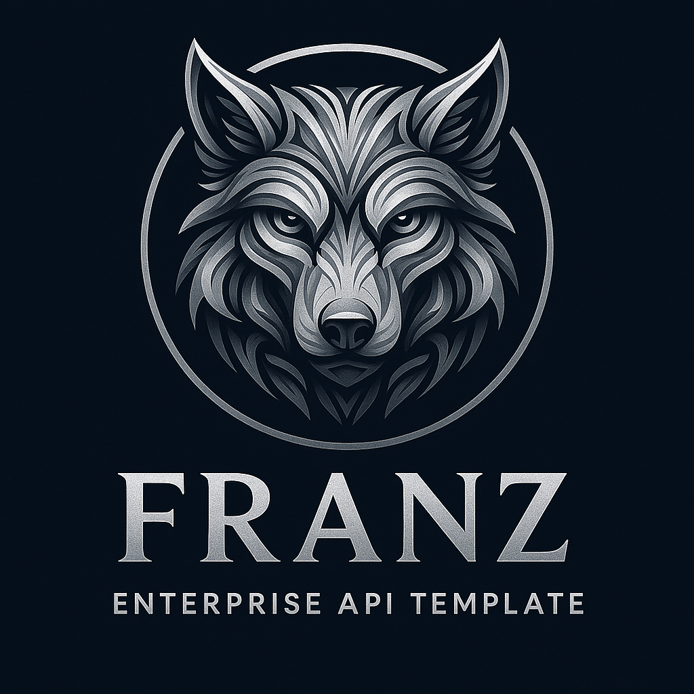
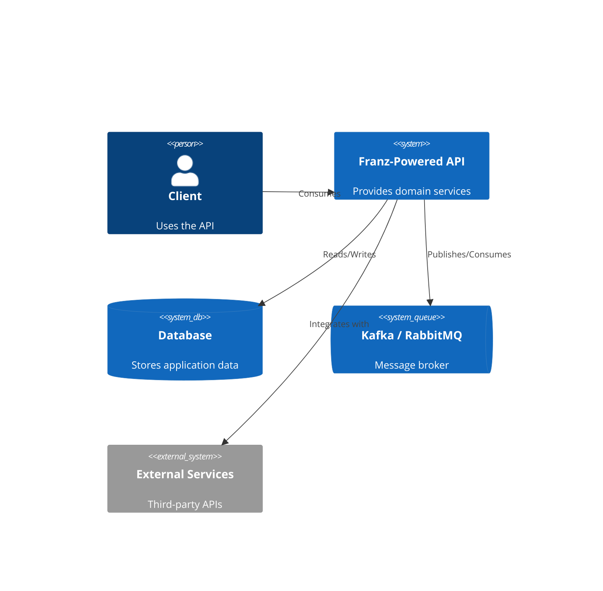
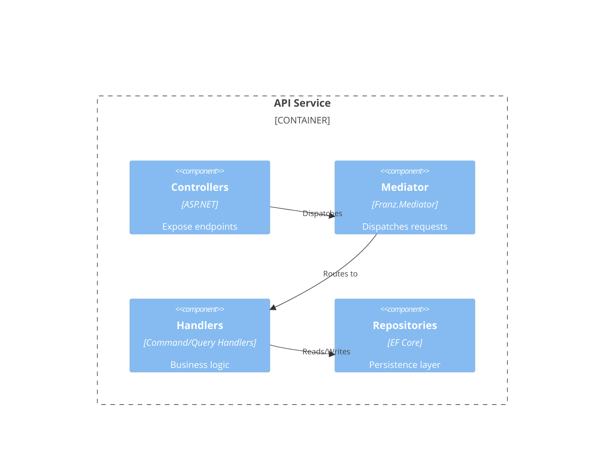

<p align="center">
  
</p>

<h1 align="center">API Project — Powered by Franz</h1>
<p align="center"><b>Deterministic Architecture for Event-Driven .NET Microservices</b></p>

<p align="center">
  
  
  
  
  
  
  
  
</p>

---

# 🔥⚡ Overview — *Architecture as Code* ⚡🔥

This API is built on top of **Franz 1.6.20**, inheriting Franz’s deterministic patterns:

- **Architecture is not documentation — it is *law***.
- Every rule is enforced at:
  - **compile-time** (ArchUnitNET tests)  
  - **runtime** (Franz pipelines & DI enforcement)  
- The project ships with:
  - **multi-cloud IaC**,  
  - **multi-CI/CD**,  
  - **Docker-first builds**,  
  - **observability**,  
  - and **resilience** baked in.

> **Spaghetti-free by design. Compliant by force. Enterprise by nature.**

---

# ✨ Features

### 🏗 Architecture as Code (ArchUnitNET)
Strict rules for:
- Handlers  
- Repositories  
- DTO naming  
- Dependency boundaries  
- Layer isolation  

> *No PR merges if architecture rules fail.*

### 📦 Mediator Pipelines (Franz.Mediator)
- Validation  
- Logging  
- Resilience (Polly)  
- OpenTelemetry instrumentation  
- Correlation + tenant propagation  

### 🔒 Resilience (Polly)
Fully integrated:
- Retries  
- Timeouts  
- Circuit breakers  
- Bulkheads  
- Fallbacks

### 📊 Observability
- Serilog + structured logs  
- OpenTelemetry tracing  
- CorrelationId everywhere  
- ELK enrichers  

### 📡 Messaging-Ready
- Kafka  
- RabbitMQ  
- Azure Event Grid  
- Outbox/inbox via Franz persistence providers  

### 🐳 Container-First
- Multi-stage Dockerfile  
- Non-root runtime  
- Built-in healthchecks  

### ☁ Cloud-Ready
- Terraform (AWS + GCP)  
- Azure Bicep  
- Built-in networking, service wiring, secrets  

### 🔄 Multi-CI/CD
- Azure DevOps  
- GitHub Actions  
- GitLab CI  
- Shared job templates

---

# 🚀 Getting Started

## Prerequisites
- **.NET 9+ SDK**
- Docker (optional)

## Install Dependencies
```bash
dotnet restore
````

## Run the API

```bash
dotnet run
```

Swagger UI:
👉 [http://localhost:5000/swagger](http://localhost:5000/swagger)

---

# 🧩 Franz Bootstrap Template

```csharp
var builder = WebApplication.CreateBuilder(args);

// Logging + Observability
builder.Host.UseHybridLog();
builder.Services.AddOpenApi();

// Application & Persistence
builder.Services.RegisterApplicationServices();
builder.Services.RegisterPersistenceServices<ApplicationDbContext>(builder.Configuration);
builder.Services.AddDatabase<ApplicationDbContext>(builder.Environment, builder.Configuration);

// HTTP Architecture
builder.Services.AddHttpArchitecture(builder.Environment, builder.Configuration);
builder.Services.AddMessagingInHttpContext(builder.Configuration);
builder.Services.AddHttpServices(builder.Configuration, TimeSpan.FromSeconds(30));
builder.Services.AddExternalServices(builder.Configuration);

// Mediator Pipelines
builder.Services.AddFranzMediatorDefault()
    .AddFranzEventValidationPipeline()
    .AddMediatorOpenTelemetry()
    .AddMediatorEventOpenTelemetry(new ActivitySource("Franz.Mediator"));

// Resilience
builder.Services.AddFranzResilience(builder.Configuration);

// CORS + API Versioning
builder.Services.AddApiVersioning(o => o.DefaultApiVersion = new ApiVersion(1, 0));
builder.Services.AddCors(p => p.AddPolicy("AllowAll", b => b.AllowAnyOrigin().AllowAnyMethod().AllowAnyHeader()));

var app = builder.Build();

// HTTP Pipeline
app.UseCors("AllowAll");
app.UseHttpArchitecture();

app.MapControllers();
app.Run();
```

---

# 🔄 CI/CD Matrix

| Platform           | Path                 | Notes                               |
| ------------------ | -------------------- | ----------------------------------- |
| **Azure DevOps**   | `pipelines/`         | Library templates + infra pipelines |
| **GitHub Actions** | `.github/workflows/` | GH-native runners + OIDC            |
| **GitLab CI**      | `.gitlab/ci/`        | Complete GitLab chains              |

---

# ☁ Multi-Cloud Infrastructure (IaC)

### **Azure (Bicep)**

* AppService / AKS
* Private networking
* KeyVault integration

### **AWS (Terraform)**

* EKS / ECS
* ALB / NLB
* RDS / DynamoDB

### **GCP (Terraform)**

* GKE
* Cloud Run
* Pub/Sub

---

# 🐳 Docker

```bash
docker build -t api-project .
docker run -p 8080:80 api-project
```

Includes:

* Non-root execution
* Health endpoint
* Multi-stage build

---

# 🧪 Architecture Rules (Franz Tribunal)

Franz enforces rules such as:

* `*CommandHandler` must implement `ICommandHandler<,>`
* `*QueryHandler` must implement `IQueryHandler<,>`
* DTOs must end with `Dto`
* Repositories follow scoped lifetime rules
* No cycle dependencies
* No infrastructure leak into domain

> **If architecture fails, the merge fails.**

---

# 📡 Messaging Example

```csharp
public class KafkaConsumerService : IHostedService
{
    private readonly IConsumer<string, string> _consumer;
    private readonly IMessageHandler _handler;

    public KafkaConsumerService(IOptions<MessagingOptions> opts, IMessageHandler handler)
    {
        _consumer = new ConsumerBuilder<string, string>(
            new ConsumerConfig { BootstrapServers = opts.Value.BootStrapServers, GroupId = opts.Value.GroupID }
        ).Build();
        _handler = handler;
    }

    public Task StartAsync(CancellationToken ct)
    {
        _consumer.Subscribe("my-topic");

        Task.Run(() =>
        {
            while (!ct.IsCancellationRequested)
            {
                var msg = _consumer.Consume(ct);
                _handler.Process(new Message(msg.Message.Value));
            }
        });

        return Task.CompletedTask;
    }
}
```

---

# 👑 Philosophy — *The Anti-Spaghetti Manifesto*

> “Most teams enforce architecture through code reviews.
> This repo enforces it through **law**.”

* Architecture is deterministic
* Rules > opinions
* Defaults are sacred
* DI rejects invalid code
* Creativity is allowed — spaghetti is not

---

# 🦉 Architectural Creed

```
FFFFFFFFF  RRRRRR    AAAAA   N   N  ZZZZZZZ
F         R    R   A     A  NN  N       ZZ
FFFFFF    RRRRRR   AAAAAAA  N N N     ZZZ
F         R   R    A     A  N  NN    ZZ
F         R    R   A     A  N   N   ZZZZZZZ
```

---

# 🏗 C4 Architecture (Mermaid)

### C1 — System Context



### C2 — Containers


### C3 — Components



---

# 🛠 Developer Environment (IDE-as-Code)

Recommended Extensions:

* GitLens
* Terraform
* Bicep
* Docker
* Kubernetes
* Serilog Analyzer
* YAML
* Markdown Mermaid Preview
* Copilot

> **Same workspace, same cockpit — every developer, every machine.**

---

# 📜 License

MIT License.


