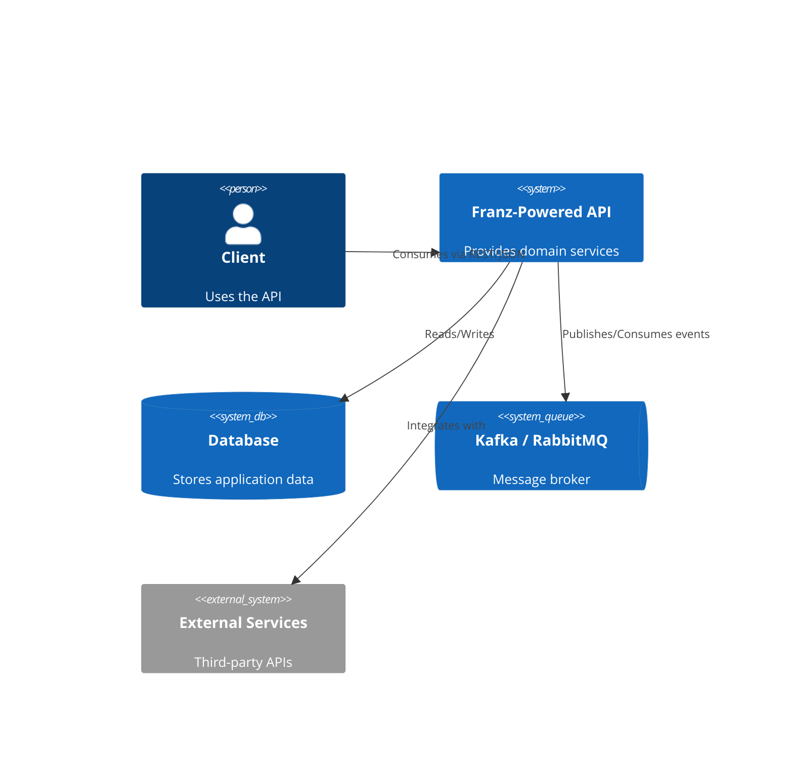
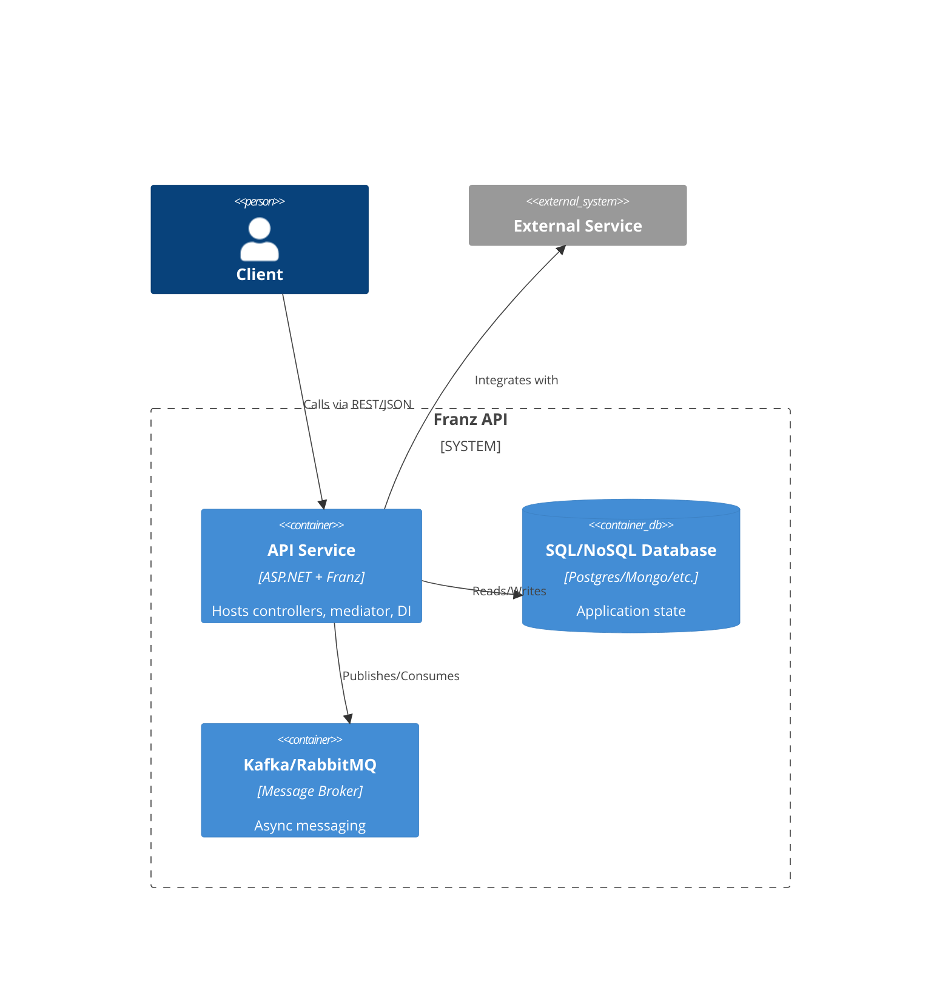
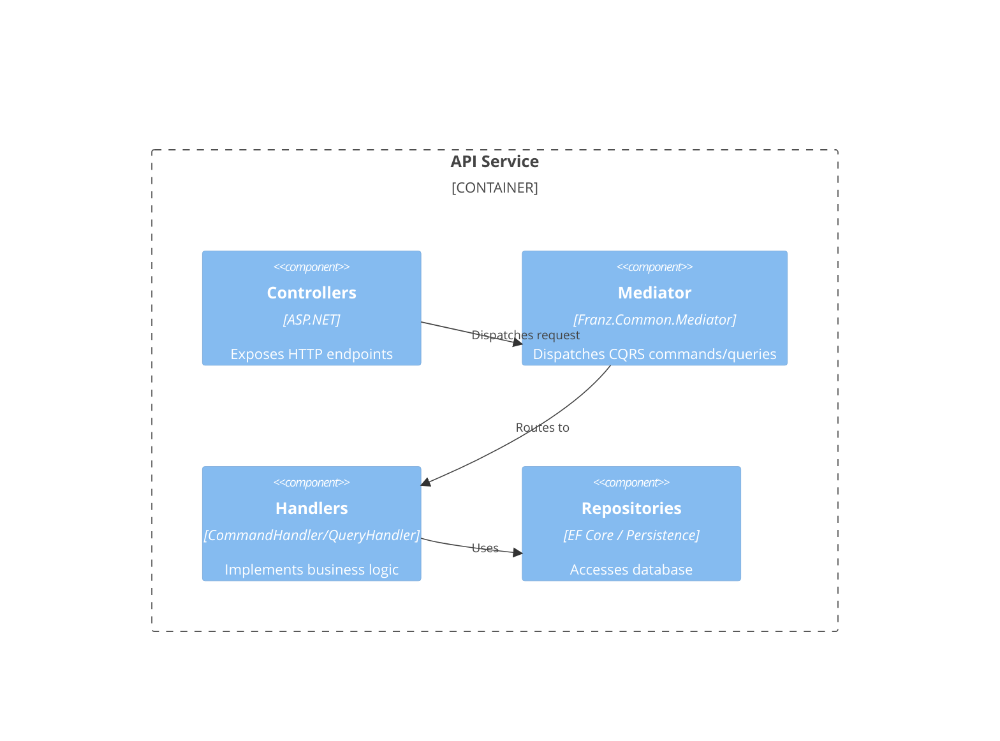

# 🔥⚡ API Project — Powered by FRANZ ⚡🔥

> **Architecture as Code** — this API is built on Franz, where discipline in engineering is law, not a democracy.
> Every architectural rule is enforced at compile-time and runtime through **architecture tests, mediator pipelines, logging, and resilience** — shipping day-1 with Docker, CI/CD, and multi-cloud IaC baked in.

---

## ✨ Features

This API is not just another boilerplate. By building on Franz, it inherits:

* 🏗 **Architecture as Code**: conventions & rules enforced by [ArchUnitNET](https://github.com/TNG/ArchUnitNET). No spaghetti allowed.
* 📦 **Mediator Pipelines**: CQRS-style command/query separation with validation, logging, resilience, and tracing.
* 🔒 **Resilience with Polly**: retries, circuit breakers, bulkheads, timeouts — all config-driven.
* 📊 **Logging & Tracing**: environment-aware Serilog, OpenTelemetry pipelines, correlation IDs, ELK-ready enrichers.
* 📡 **Messaging Ready**: Kafka, RabbitMQ, and Event Grid consumers/producers, wired with Franz defaults.
* 🐳 **Container-first**: multi-stage Dockerfile, non-root runtime, built-in healthchecks.
* ☁ **Cloud-ready**: Terraform + Bicep modules for **Azure**, **AWS**, **GCP** (Cloud Run, GKE, networking, databases, Kafka).
* 🔄 **Multi-CI/CD support**: templates for **Azure DevOps**, **GitHub Actions**, **GitLab CI**.

---

## 🚀 Getting Started

### Prerequisites

* .NET 8 SDK
* Docker (optional, for containerized runs)

### Install Dependencies

```bash
dotnet restore
```

### Run Locally

```bash
dotnet run
```

Open [http://localhost:5000/swagger](http://localhost:5000/swagger) to explore the API.

---

## 🧩 Bootstrap Code

The API is bootstrapped with Franz defaults:

```csharp
var builder = WebApplication.CreateBuilder(args);

builder.Host.UseHybridLog();
builder.Services.AddControllers();
builder.Services.AddOpenApi();
builder.Services.RegisterApplicationServices();
builder.Services.RegisterPersistenceServices<ApplicationDbContext>(builder.Configuration);
builder.Services.AddDatabase<ApplicationDbContext>(builder.Environment, builder.Configuration);

// HTTP & Messaging
builder.Services.AddHttpArchitecture(builder.Environment, builder.Configuration);
builder.Services.AddMessagingInHttpContext(builder.Configuration);
builder.Services.AddHttpServices(builder.Configuration, TimeSpan.FromSeconds(30));
builder.Services.AddExternalServices(builder.Configuration);

// Mediator & Resilience
builder.Services.AddFranzMediatorDefault()
    .AddFranzEventValidationPipeline()
    .AddMediatorOpenTelemetry()
    .AddMediatorEventOpenTelemetry(new ActivitySource("Franz.Mediator"));

builder.Services.AddFranzResilience(builder.Configuration);

// API & CORS
builder.Services.AddApiVersioning(o => { o.DefaultApiVersion = new ApiVersion(1, 0); });
builder.Services.AddCors(p => p.AddPolicy("AllowAll", b => b.AllowAnyOrigin().AllowAnyMethod().AllowAnyHeader()));

var app = builder.Build();
app.UseCors("AllowAll");
app.UseHttpArchitecture();
app.MapControllers();
app.Run();
```

---

## 🔄 CI/CD

The API inherits Franz’s **multi-CI/CD matrix**:

| CI/CD Provider     | Location             | Notes                                |
| ------------------ | -------------------- | ------------------------------------ |
| **Azure DevOps**   | `pipelines/`         | Build, Infra, Publish YAML templates |
| **GitHub Actions** | `.github/workflows/` | Portable jobs for GH-native runners  |
| **GitLab CI**      | `.gitlab/ci/`        | Ready-to-use `.gitlab-ci.yml` chain  |

💡 Pick your provider, drop in secrets, and go live.

---

## ☁ Infrastructure as Code

Infrastructure is reproducible across providers:

* **Terraform (GCP modules)** → `cloudrun`, `gke`, `kafka`, `networking`, `database`.
* **Terraform (Infra boilerplate)** → backends, outputs, variables. Extendable to AWS + Azure.
* **Azure Bicep** → `Infrastructure/main.bicep` with modularized imports under `Infrastructure/Modules/`.

---

## 🐳 Docker

```bash
docker build -t api-project .
docker run -p 8080:80 api-project
```

Includes:

* Multi-stage build (`sdk → publish → runtime`)
* Healthcheck endpoint (`/health`)
* Non-root user runtime

---

## 🧪 Architecture Tests

All critical conventions are enforced via `Franz.Testing`:

* ✅ Command handlers must end with `CommandHandler` and implement `ICommandHandler<,>`.
* ✅ Query handlers must end with `QueryHandler` and implement `IQueryHandler<,>`.
* ✅ DTOs must end with `Dto`.
* ✅ Repositories must implement correct lifetimes (`IScopedDependency`, `ISingletonDependency`).

No PR merges unless architecture tests pass.

---

## 📦 Messaging Example

### Kafka Consumer

```csharp
public class KafkaConsumerService : IHostedService
{
    private readonly IConsumer<string, string> _consumer;
    private readonly IMessageHandler _handler;

    public KafkaConsumerService(IOptions<MessagingOptions> opts, IMessageHandler handler)
    {
        _consumer = new ConsumerBuilder<string, string>(
            new ConsumerConfig { BootstrapServers = opts.Value.BootStrapServers, GroupId = opts.Value.GroupID }
        ).Build();
        _handler = handler;
    }

    public Task StartAsync(CancellationToken ct)
    {
        _consumer.Subscribe("my-topic");
        Task.Run(() => { 
            while (!ct.IsCancellationRequested) 
            { 
                var msg = _consumer.Consume(ct); 
                _handler.Process(new Message(msg.Message.Value)); 
            }});
        return Task.CompletedTask;
    }
}
```

---

## 📜 Changelog

See [CHANGELOG.md](./CHANGELOG.md) for version history.
Latest release: **1.6.2 — Unified Resilience Bootstrapper**

---

## 👑 Philosophy

This API = **the vaccine against spaghetti**.

Most teams: *“We enforce architecture with code reviews and Confluence docs.”*
This API (via Franz): *“Who said this was a democracy?”*

Architecture is **not optional**, it’s **codified and enforced**.

---

## ⚡ Quick Pitch

> *“What Franz, and I, can do in 72 hours — most pro teams battle months to achieve.”*

* Day 1: Templates & Framework
* Day 2: Documentation
* Day 3: MVP models ready — **microservices or monolith, doesn’t matter**

---

## 🦉 Our Architectural Creed

```
FFFFFFFFF  RRRRRR    AAAAA   N   N  ZZZZZZZ
F         R    R   A     A  NN  N       ZZ
FFFFFF    RRRRRR   AAAAAAA  N N N     ZZZ
F         R   R    A     A  N  NN    ZZ
F         R    R   A     A  N   N   ZZZZZZZ
```

**The Creed**:

1. **Opinionated from scratch.** This API works day one — no excuses, no yak-shaving.
2. **No scraps allowed.** Work outside the rules and DI will pretend your code doesn’t exist.
3. **This is not a democracy.** The architecture rules with the iron silk of *do it the right way*.
4. **Defaults are sacred.** They exist because chaos is the alternative.
5. **Tests never lie.** If you drift, the failing suite will expose your laziness.
6. **Creativity is welcome — as long as it doesn’t look like spaghetti.**

---

⚡ **This API is not just written — it’s enforced. Comply, or the tests will slap you back into line.**

---

## 🏗 C4 Architecture

### C1: System Context



---

### C2: Containers



---

### C3: Components (Inside API)



---

### 📌 Notes

* **Enforcement**: Architecture tests ensure handlers, DTOs, and repositories follow rules.
* **Scalability**: Kafka/RabbitMQ allows scaling beyond REST.
* **Extensibility**: External services plug into Franz via HTTP + Resilience pipelines.


