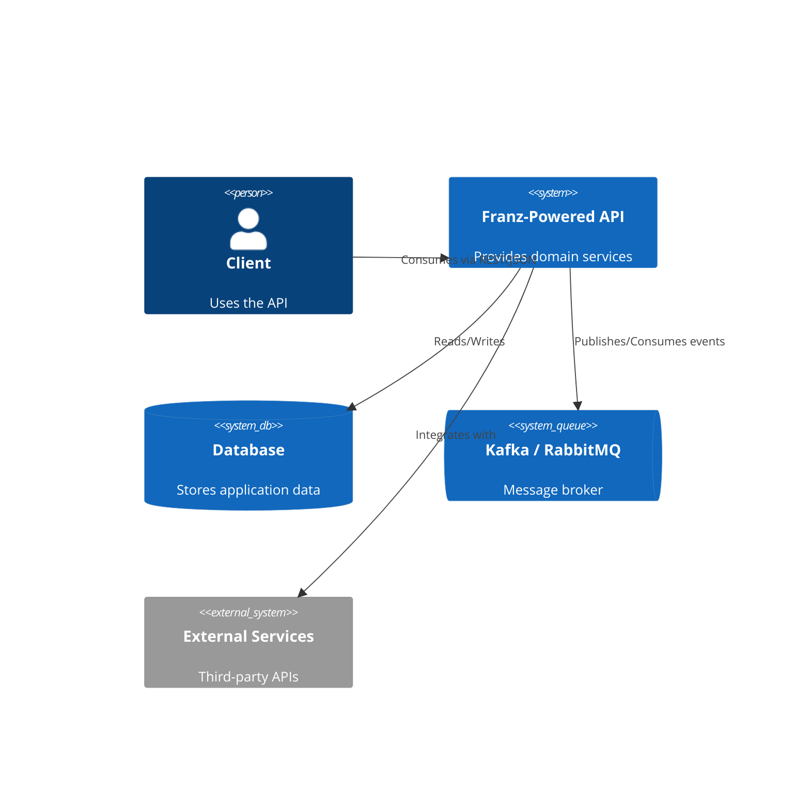
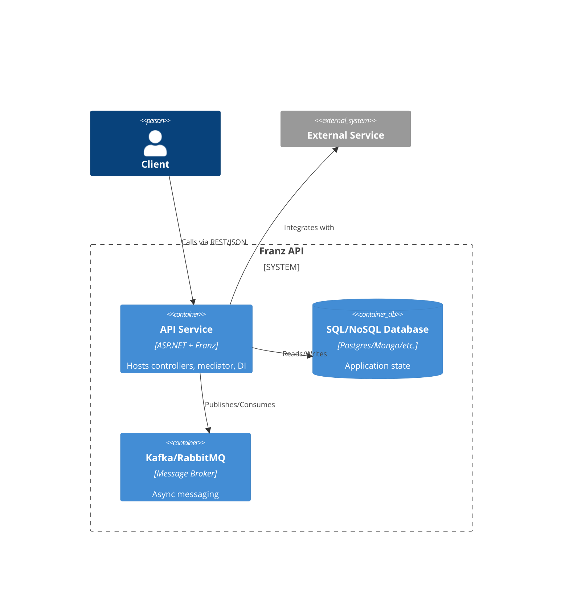
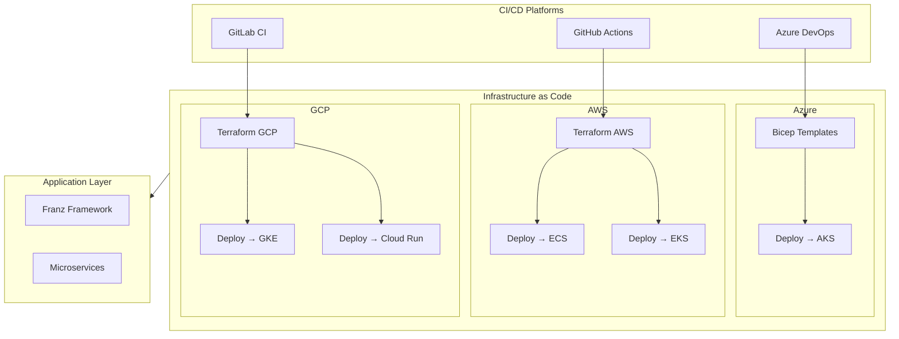

# 🔥⚡ API Project — Powered by FRANZ ⚡🔥

> **Architecture as Code** — built on Franz, where **discipline is law, not suggestion**.
> Every rule is enforced at compile-time and runtime via **architecture tests, mediator pipelines, logging, and resilience**.
> Ships day-1 with **Docker, CI/CD, and multi-cloud IaC** baked in.

---

## ✨ Features

This API is **not boilerplate**. By using Franz, it inherits:

* 🏗 **Architecture as Code** → rules enforced by [ArchUnitNET](https://github.com/TNG/ArchUnitNET). No spaghetti allowed.
* 📦 **Mediator Pipelines** → CQRS separation with validation, logging, resilience, and tracing.
* 🔒 **Resilience with Polly** → retries, circuit breakers, bulkheads, timeouts — all config-driven.
* 📊 **Observability** → Serilog, OpenTelemetry, correlation IDs, ELK enrichers.
* 📡 **Messaging-ready** → Kafka, RabbitMQ, Event Grid with Franz defaults.
* 🐳 **Container-first** → multi-stage Dockerfile, non-root runtime, healthchecks.
* ☁ **Cloud-ready** → Terraform + Bicep modules for **Azure, AWS, GCP**.
* 🔄 **Multi-CI/CD** → ready-to-run pipelines for Azure DevOps, GitHub Actions, GitLab CI.

---

## 🚀 Getting Started

### Prerequisites

* .NET 8 SDK
* Docker (optional, for containerized runs)

### Install Dependencies

```bash
dotnet restore
```

### Run Locally

```bash
dotnet run
```

👉 Open [http://localhost:5000/swagger](http://localhost:5000/swagger) to explore the API.

---

## 🧩 Bootstrap Code

```csharp
var builder = WebApplication.CreateBuilder(args);

builder.Host.UseHybridLog();
builder.Services.AddControllers();
builder.Services.AddOpenApi();
builder.Services.RegisterApplicationServices();
builder.Services.RegisterPersistenceServices<ApplicationDbContext>(builder.Configuration);
builder.Services.AddDatabase<ApplicationDbContext>(builder.Environment, builder.Configuration);

// HTTP & Messaging
builder.Services.AddHttpArchitecture(builder.Environment, builder.Configuration);
builder.Services.AddMessagingInHttpContext(builder.Configuration);
builder.Services.AddHttpServices(builder.Configuration, TimeSpan.FromSeconds(30));
builder.Services.AddExternalServices(builder.Configuration);

// Mediator & Resilience
builder.Services.AddFranzMediatorDefault()
    .AddFranzEventValidationPipeline()
    .AddMediatorOpenTelemetry()
    .AddMediatorEventOpenTelemetry(new ActivitySource("Franz.Mediator"));

builder.Services.AddFranzResilience(builder.Configuration);

// API & CORS
builder.Services.AddApiVersioning(o => { o.DefaultApiVersion = new ApiVersion(1, 0); });
builder.Services.AddCors(p => p.AddPolicy("AllowAll", b => b.AllowAnyOrigin().AllowAnyMethod().AllowAnyHeader()));

var app = builder.Build();
app.UseCors("AllowAll");
app.UseHttpArchitecture();
app.MapControllers();
app.Run();
```

---

## 🔄 CI/CD

| CI/CD Provider     | Location             | Notes                               |
| ------------------ | -------------------- | ----------------------------------- |
| **Azure DevOps**   | `pipelines/`         | Modular job templates (build/infra) |
| **GitHub Actions** | `.github/workflows/` | GH-native runners & secrets         |
| **GitLab CI**      | `.gitlab/ci/`        | Complete `.gitlab-ci.yml` chains    |

💡 Choose your platform → configure secrets → **ship to cloud**.

---

## ☁ Multi-Cloud Infrastructure

* **Terraform GCP** → Cloud Run, GKE, networking, DBs, Kafka.
* **Terraform AWS** → EKS, ECS, RDS, VPCs, messaging.
* **Azure Bicep** → `Infrastructure/AzureDevOps-Bicep/`.

---

## 🐳 Docker

```bash
docker build -t api-project .
docker run -p 8080:80 api-project
```

* Multi-stage build (`sdk → publish → runtime`)
* Healthcheck endpoint (`/health`)
* Runs as **non-root**

---

## 🧪 Architecture Tests

✅ Command handlers → `*CommandHandler` implementing `ICommandHandler<,>`
✅ Query handlers → `*QueryHandler` implementing `IQueryHandler<,>`
✅ DTOs → must end with `Dto`
✅ Repositories → respect lifetimes (`Scoped`, `Singleton`)

👉 No PR merges unless architecture rules pass.

---

## 📦 Messaging Example

```csharp
public class KafkaConsumerService : IHostedService
{
    private readonly IConsumer<string, string> _consumer;
    private readonly IMessageHandler _handler;

    public KafkaConsumerService(IOptions<MessagingOptions> opts, IMessageHandler handler)
    {
        _consumer = new ConsumerBuilder<string, string>(
            new ConsumerConfig { BootstrapServers = opts.Value.BootStrapServers, GroupId = opts.Value.GroupID }
        ).Build();
        _handler = handler;
    }

    public Task StartAsync(CancellationToken ct)
    {
        _consumer.Subscribe("my-topic");
        Task.Run(() => { 
            while (!ct.IsCancellationRequested) 
            { 
                var msg = _consumer.Consume(ct); 
                _handler.Process(new Message(msg.Message.Value)); 
            }});
        return Task.CompletedTask;
    }
}
```

---

## 👑 Philosophy

This API = **the vaccine against spaghetti**.

* Most teams: *“We enforce architecture with reviews and docs.”*
* This repo: *“Who said this was a democracy?”*

Architecture is **not optional**, it’s **codified and enforced**.

---

## 🦉 Architectural Creed

```
FFFFFFFFF  RRRRRR    AAAAA   N   N  ZZZZZZZ
F         R    R   A     A  NN  N       ZZ
FFFFFF    RRRRRR   AAAAAAA  N N N     ZZZ
F         R   R    A     A  N  NN    ZZ
F         R    R   A     A  N   N   ZZZZZZZ
```

**The Creed**:

1. Opinionated from scratch — works day one.
2. No scraps allowed — DI ignores non-compliant code.
3. This is not a democracy — rules > opinions.
4. Defaults are sacred.
5. Tests never lie.
6. Creativity is welcome, spaghetti is not.

---

## 🏗 C4 Diagrams

### C1: System Context



### C2: Containers



### C3: Components


---

## 🌍 Multi-Cloud CI/CD



---

## 🛠 Developer Environment (IDE-as-Code)

Ships with **VS Code recommendations**.
Copy repo → open in VS Code → install extensions → instant cockpit.

### Recommended Extensions

* GitLens / Git Graph
* Terraform, Bicep, YAML
* Azure / AWS / GCP toolkits
* Docker, Kubernetes
* Markdown Preview Mermaid
* AI: GitHub Copilot, Windows AI Studio

⚡ **IDE-as-Code**: same cockpit, everywhere.

---