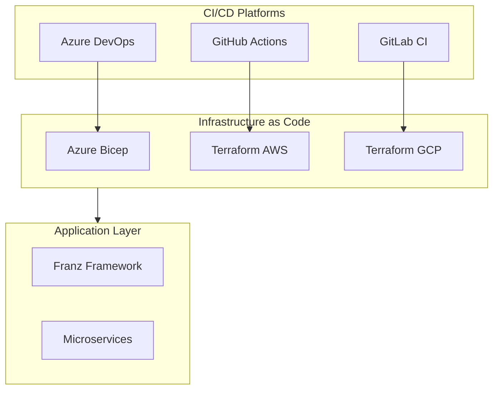
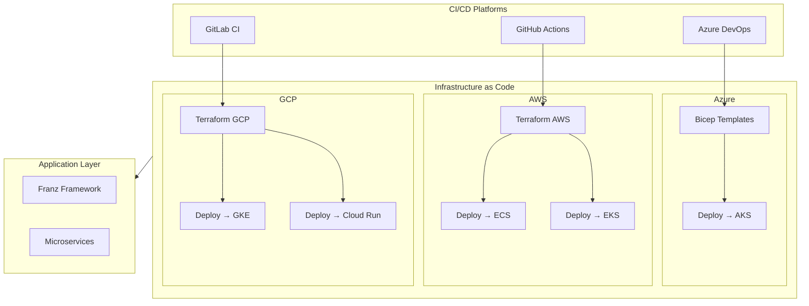

# Repository Architecture

This repository is designed as a **multi-cloud, multi-CI platform** with strict separation of concerns and symmetry across AWS, Azure, and GCP.

## Structure

```

Infrastructure/
├── AzureDevOps-Bicep/     # Azure infra defined in Bicep
├── Terraform-AWS/         # AWS infra with Terraform
├── Terraform-GCP/         # GCP infra with Terraform

pipelines/                  # Azure DevOps YAML jobs
.github/workflows/          # GitHub Actions workflows
.gitlab/ci/                 # GitLab CI/CD pipelines

````

## CI/CD Flow

- **Build & Test** → restore, build, test .NET code
- **Docker Build & Push** → builds images, pushes to cloud registry
- **Infra Deploy** → provisions infra via Bicep/Terraform
- **Service Deploy** → deploys to Azure, GCP, or AWS targets (AKS, GKE, EKS, Cloud Run, ECS)

## Architecture Diagram


## Multi-Cloud Deployment Architecture



